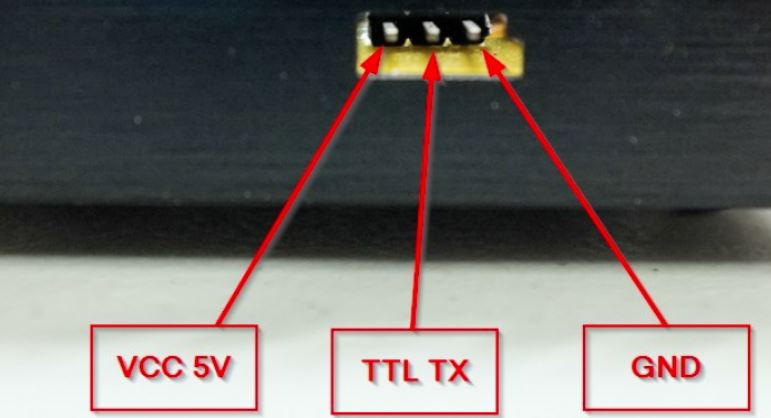

# jkjkjkjkj
## lklklklkl


```
dwc_otg.lpm_enable=0 **console=serial0**,115200 console=tty1 root=/dev/mmcblk0p2 
rootfstype=ext4 elevator=deadline fsck.repair=yes root wait
---
setenv bootargs console=ttyS0,115200 ...
```
```python
import serial
ser = serial.Serial('/dev/ttyUSB0', 9600, timeout=1)
print(ser.name)
#ser.close()
while 1 :
    x = ser.read()
    if x == '{':
        msg = ser.read(75)
        msg = x + msg
        msgbytes = bytearray(msg)
        #print msg
        msgbytes[8] = msgbytes[8] - 128
        msgbytes[33] = msgbytes[33] - 128
        msgbytes[34] = msgbytes[34] - 128
        print ("Modo: %d Amps: %d.%d" % (msgbytes[8],msgbytes[33],msgbytes[34]))
```
```c++
#include <ESP8266WiFi.h>
#include <ESP8266WiFiMulti.h>
#include <ArduinoOTA.h>
#include <ESP8266WebServer.h>
#include <ESP8266mDNS.h>
#include <FS.h>
#include <WebSocketsServer.h>

ESP8266WiFiMulti wifiMulti;       // Create an instance of the ESP8266WiFiMulti class, called 'wifiMulti'

ESP8266WebServer server = ESP8266WebServer(80);       // create a web server on port 80
WebSocketsServer webSocket = WebSocketsServer(81);    // create a websocket server on port 81

File fsUploadFile;                                    // a File variable to temporarily store the received file

const char *ssid = "ESP8266 Access Point"; // The name of the Wi-Fi network that will be created
const char *password = "thereisnospoon";   // The password required to connect to it, leave blank for an open network

const char *OTAName = "ESP8266";           // A name and a password for the OTA service
const char *OTAPassword = "esp8266";

#define LED_RED     15            // specify the pins with an RGB LED connected
#define LED_GREEN   12
#define LED_BLUE    13

const char* mdnsName = "esp8266"; // Domain name for the mDNS responder
```

## Welcome to GitHub Pages

You can use the [editor on GitHub](https://github.com/vicen-t/imax-charge-station/edit/master/README.md) to maintain and preview the content for your website in Markdown files.

Whenever you commit to this repository, GitHub Pages will run [Jekyll](https://jekyllrb.com/) to rebuild the pages in your site, from the content in your Markdown files.

### Markdown

Markdown is a lightweight and easy-to-use syntax for styling your writing. It includes conventions for

```markdown
Syntax highlighted code block

# Header 1
## Header 2
### Header 3

- Bulleted
- List

1. Numbered
2. List

**Bold** and _Italic_ and `Code` text

[Link](url) and 
```

For more details see [GitHub Flavored Markdown](https://guides.github.com/features/mastering-markdown/).

### Jekyll Themes

Your Pages site will use the layout and styles from the Jekyll theme you have selected in your [repository settings](https://github.com/vicen-t/imax-charge-station/settings). The name of this theme is saved in the Jekyll `_config.yml` configuration file.

### Support or Contact

Having trouble with Pages? Check out our [documentation](https://help.github.com/categories/github-pages-basics/) or [contact support](https://github.com/contact) and we’ll help you sort it out.

